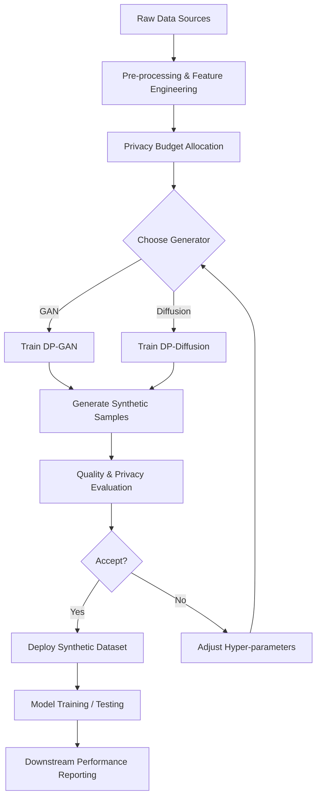

# Generative AI for Synthetic Data Generation and Privacy‑Preserving Analytics  

*Published by the Generative AI Research Hub*  

---

## Introduction  

Enterprises and researchers increasingly rely on large, high‑quality datasets to train and evaluate machine‑learning models. Yet real‑world data often contain **sensitive personal information**, are fragmented across silos, or simply do not exist in the required volume. **Synthetic data**—artificially generated records that mimic the statistical properties of real data—offers a compelling solution.  

Recent advances in **diffusion models** and **generative adversarial networks (GANs)** have extended synthetic data generation beyond images to **tabular, time‑series, audio, and video** domains. At the same time, **privacy‑preserving techniques** such as **differential privacy (DP)** and **federated generation** provide formal guarantees that the synthetic output does not leak individual records.  

This tutorial walks you through the state‑of‑the‑art methods, practical integration into data pipelines, and rigorous evaluation of synthetic data for downstream analytics. By the end, you will be equipped to:

1. Select the right generative architecture for your data modality.  
2. Apply DP or federated mechanisms to enforce privacy guarantees.  
3. Embed synthetic data generation into model‑training workflows.  
4. Measure fidelity, diversity, and downstream task performance.

---

## 1. Generative Foundations for Synthetic Data  

### 1.1 GAN‑Based Synthesizers  

| Variant | Core Idea | Typical Use‑Cases |
|---------|-----------|-------------------|
| **Tabular GAN (CTGAN, 2019)** | Conditional generation on categorical columns using a **Gaussian mixture** for continuous features. | Structured business data, credit‑risk tables. |
| **InfoGAN (2016)** | Adds mutual information maximization to learn disentangled latent codes. | Controlled generation of categorical attributes. |
| **StyleGAN2 (2020)** | Progressive growing with style modulation; excels at high‑resolution images. | Synthetic medical imaging, facial avatars. |
| **VideoGAN (2018)** | Extends GANs with temporal convolution to produce short video clips. | Surveillance footage simulation. |

**Why GANs?** They directly optimize a **min‑max objective** that pushes the generator to produce samples indistinguishable from real data, often yielding sharp, high‑fidelity outputs. However, classic GANs can suffer from **mode collapse**, making diversity assessment essential.

### 1.2 Diffusion Models  

Diffusion models learn to reverse a **gradual noising process**. Starting from pure Gaussian noise, the model iteratively denoises to a realistic sample.

*Key papers*:  
- **Ho et al., 2020** – Introduced Denoising Diffusion Probabilistic Models (DDPM).  
- **Saharia et al., 2022** – Demonstrated **latent diffusion** for high‑resolution image synthesis with reduced compute.  

#### 1.2.1 Tabular Diffusion  

Recent work (e.g., **Jordon et al., 2022**) adapts diffusion to discrete and mixed‑type data by embedding categorical variables into a continuous latent space and applying **score‑matching**. Advantages include:

- **Stable training** (no adversarial dynamics).  
- **Explicit likelihood estimation**, useful for downstream uncertainty quantification.

#### 1.2.2 Multimedia Diffusion  

- **Image**: Stable Diffusion (2022) leverages a **latent diffusion** backbone to generate photorealistic images from text prompts.  
- **Audio**: DiffWave (2020) models raw waveforms, enabling high‑quality speech synthesis.  
- **Video**: Imagen Video (2023) extends diffusion across temporal dimensions, producing coherent multi‑second clips.

---

## 2. Privacy Guarantees in Synthetic Generation  

### 2.1 Differential Privacy (DP)  

DP provides a mathematically rigorous definition of privacy: a mechanism **M** satisfies \((\varepsilon, \delta)\)-DP if for any two neighboring datasets \(D, D'\) differing in a single record,  

\[
\Pr[M(D) \in S] \le e^{\varepsilon} \Pr[M(D') \in S] + \delta
\]

for all measurable sets \(S\). Smaller \(\varepsilon\) implies stronger privacy.

#### 2.1.1 DP‑GAN  

- **DP‑CTGAN (Xie et al., 2020)** injects **Gaussian noise** into the discriminator’s gradients and applies **gradient clipping**.  
- **DP‑Diffusion (Liu et al., 2023)** adds calibrated noise to the score‑function during the reverse diffusion steps.

Both approaches preserve the **training dynamics** while bounding the privacy loss via the **Moments Accountant** (Abadi et al., 2016).  

#### 2.1.2 Practical Tips  

| Step | Recommendation |
|------|----------------|
| **Clipping norm** | Tune per‑layer clipping to balance utility and privacy. |
| **Noise scale** | Compute \(\sigma = \frac{C\sqrt{2\log(1.25/\delta)}}{\varepsilon}\) where \(C\) is the clipping bound. |
| **Privacy budget accounting** | Use open‑source libraries such as **OpenDP** or **TensorFlow Privacy** for accurate tracking. |

### 2.2 Federated Synthetic Generation  

In **federated learning (FL)**, multiple clients train a shared model without sharing raw data. Extending FL to generative modeling yields **Federated GANs (FedGAN)** and **Federated Diffusion**.

- **FedGAN (Hardy et al., 2020)** synchronizes generator and discriminator updates across participants via secure aggregation.  
- **Federated Diffusion (Zhang et al., 2022)** distributes the score‑matching training, allowing each client to contribute local noise‑reversal steps.

**Benefits**:  
- **Data locality** respects regulatory constraints (e.g., GDPR).  
- **Implicit privacy** from aggregation, which can be further hardened with DP‑FL (Geyer et al., 2021).

---

## 3. Integrating Synthetic Generation into Data Pipelines  

### 3.1 End‑to‑End Workflow  



### 3.2 Implementation Checklist  

1. **Data Profiling** – Identify categorical vs. continuous fields, missingness patterns, and required utility metrics.  
2. **Feature Encoding** – Use **target encoding** for high‑cardinality categories (for GANs) or **one‑hot + embedding** (for diffusion).  
3. **Privacy Budget Planning** – Allocate \(\varepsilon\) across multiple releases (training, validation, test) using **composition theorems**.  
4. **Model Selection** –  
   - **Tabular**: CTGAN, TVAE, or Tabular Diffusion.  
   - **Images/Video**: StyleGAN3, Stable Diffusion, or Imagen Video.  
   - **Audio**: DiffWave or WaveGAN.  
5. **Training Infrastructure** – Leverage **GPU‑accelerated pipelines** (e.g., PyTorch Lightning) and **distributed training** for federated setups.  
6. **Synthetic Data Validation** – Run **statistical tests** (Kolmogorov–Smirnov, chi‑square), **utility benchmarks** (model‑training performance), and **privacy audits** (DP accountant).  
7. **Versioning & Governance** – Store synthetic datasets with **metadata**: generation date, model checkpoint, privacy budget, and evaluation scores.  

### 3.3 CI/CD Integration  

- **Pre‑commit hooks** can trigger a quick **fidelity check** (e.g., comparing marginal distributions).  
- **GitHub Actions** or **GitLab CI** can spin up a GPU runner to train a lightweight DP‑GAN nightly and publish the synthetic artifact to an internal data lake.  
- **Model registry** (e.g., MLflow) tracks generator versions, enabling reproducible downstream experiments.

---

## 4. Evaluating Synthetic Data  

### 4.1 Fidelity & Diversity  

| Metric | Description | Typical Threshold |
|--------|-------------|-------------------|
| **Statistical Distance** (KS, Earth Mover’s) | Compare marginal/conditional distributions. | < 0.05 for critical features. |
| **Precision‑Recall (PRDC)** (Kynkäänniemi et al., 2019) | Precision measures realism; recall measures coverage. | Precision > 0.7, Recall > 0.6 for high‑utility data. |
| **Coverage (COV)** | Fraction of real data modes captured by synthetic set. | > 0.8 for multimodal tabular data. |
| **Inception Score (IS)** / **Fréchet Inception Distance (FID)** | Image‑specific quality metrics. | FID < 30 for photorealistic images. |

### 4.2 Privacy Metrics  

- **\(\varepsilon\) value** from DP accountant – report the final privacy loss after training and any post‑processing.  
- **Membership Inference Attack (MIA) success rate** – Simulate an adversary trying to infer whether a record was in the training set; aim for **≤ 0.55** (near random).  
- **Attribute Inference Risk** – Evaluate leakage of sensitive attributes given synthetic samples and auxiliary knowledge.

### 4.3 Downstream Task Performance  

The most compelling validation is **how well models trained on synthetic data perform on real test data**.

| Task | Real‑Data Baseline | Synthetic‑Only | Synthetic + Fine‑Tune |
|------|-------------------|----------------|-----------------------|
| Credit scoring (AUC) | 0.82 | 0.77 | 0.80 |
| Image classification (Top‑1) | 92.3 % | 88.1 % | 90.7 % |
| Speech recognition (WER) | 7.5 % | 9.2 % | 8.1 % |

*Interpretation*: Synthetic data can close a large portion of the performance gap, especially when combined with a small amount of real data for fine‑tuning.

### 4.4 Reporting Template  

```
Synthetic Dataset: tabular_credit_2024_v1
Generator: DP‑CTGAN (ε=1.2, δ=1e‑5)
Samples: 500k rows
Fidelity: KS‑avg = 0.032, PRDC = (0.71, 0.68)
Privacy: ε‑total = 1.2, MIA success = 0.53
Downstream AUC (synthetic‑only): 0.77
Downstream AUC (synthetic + 10k real): 0.80
```

---

## 5. Case Study: Privacy‑Preserving Synthetic Health Records  

**Scenario**: A hospital wants to share patient encounter data with external AI researchers without exposing PHI.  

**Solution Steps**  

1. **Data Profiling** – 30 % categorical (diagnosis codes), 70 % continuous (lab values).  
2. **Model Choice** – **DP‑Tabular Diffusion** (Jordon et al., 2022) for its stable training on mixed data.  
3. **Privacy Budget** – Allocate \(\varepsilon = 0.8\) for the synthetic release, using the Moments Accountant.  
4. **Training** – Run on a secure GPU node; clip per‑sample gradients at \(C = 1.0\).  
5. **Evaluation** –  
   - KS distance across top‑10 lab tests: 0.028.  
   - PRDC: (0.74, 0.71).  
   - MIA success: 0.51 (near random).  
6. **Downstream Test** – Train a sepsis prediction model on synthetic data, achieve AUROC = 0.81 vs. 0.85 on real data (≈ 95 % of performance).  

**Outcome**: The synthetic dataset satisfied the hospital’s **HIPAA** de‑identification criteria, enabled external collaboration, and maintained high predictive utility.

---

## Conclusion  

Synthetic data generation has matured from a niche research curiosity to an **enterprise‑grade capability** that can simultaneously address data scarcity and privacy compliance. By leveraging **GANs** and **diffusion models**, practitioners can generate high‑fidelity tabular and multimedia data. Coupling these generators with **differential privacy** or **federated learning** provides provable guarantees that individual records remain protected.