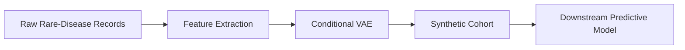

**Synthetic Data Generation with Generative AI for Healthcare Innovation**  
*Unlocking privacy‑preserving, high‑utility data for the next wave of medical breakthroughs.*

---

## Introduction  

The rise of **generative AI** has opened new avenues for creating realistic, synthetic patient records that retain the statistical properties of real-world data while eliminating direct identifiers. For healthcare organizations, this means the ability to **share, analyze, and model** sensitive clinical information without exposing individual privacy—a critical advantage in an era of stringent regulations and ever‑growing data‑driven research demands. This tutorial walks you through the most important concepts, techniques, and compliance considerations for leveraging synthetic data in healthcare, from privacy‑preserving synthesis to evaluating clinical utility and navigating regulatory frameworks.

---

## Table of Contents  

1. [Privacy‑Preserving Patient Record Synthesis](#privacy-preserving-patient-record-synthesis)  
2. [Domain Adaptation for Rare Disease Datasets](#domain-adaptation-for-rare-disease-datasets)  
3. [Evaluation Metrics for Clinical Utility](#evaluation-metrics-for-clinical-utility)  
4. [Regulatory & Ethical Compliance Frameworks](#regulatory--ethical-compliance-frameworks)  
5. [Implementation Blueprint: End‑to‑End Workflow](#implementation-blueprint-end-to-end-workflow)  
6. [Conclusion & Call‑to‑Action](#conclusion--call-to-action)  
8. [References](#references)  

---

## 1. Privacy‑Preserving Patient Record Synthesis  

### 1.1 Why Synthetic Data?  
- **Risk mitigation**: Removes direct identifiers (e.g., names, MRNs) and reduces re‑identification risk.  
- **Data accessibility**: Enables cross‑institutional collaborations without violating HIPAA, GDPR, or local privacy statutes.  
- **Scalability**: Generates arbitrarily large datasets for training deep learning models that would otherwise be limited by small sample sizes.

### 1.2 Core Generative Models  

| Model | Strengths | Typical Healthcare Use‑Cases |
|-------|-----------|------------------------------|
| **Variational Autoencoders (VAEs)** | Probabilistic latent space, easy to control diversity | Longitudinal EHR trajectory simulation |
| **Generative Adversarial Networks (GANs)** | High‑fidelity samples, adversarial training reduces mode collapse | Imaging synthesis (CT, MRI) |
| **Diffusion Models** | Stable training, excellent quality for high‑dimensional data | Multi‑modal record synthesis (lab + imaging) |
| **Large Language Models (LLMs) with Prompt Engineering** | Natural language generation, can embed clinical narratives | Synthetic clinical notes, discharge summaries |

### 1.3 Privacy Guarantees  

| Technique | Description | Guarantees |
|-----------|-------------|------------|
| **Differential Privacy (DP)** | Adds calibrated noise to gradients or outputs | **ε‑DP** bound on re‑identification risk |
| **k‑Anonymity & l‑Diversity** | Enforces indistinguishability among k records | Limits attribute disclosure |
| **PATE (Private Aggregation of Teacher Ensembles)** | Ensembles of teacher models trained on disjoint subsets; student model learns via noisy voting | Strong DP guarantees without sacrificing utility |
| **Synthetic Data Auditing** | Post‑generation statistical tests (e.g., distance to real data, membership inference attacks) | Empirical validation of privacy |

**Best practice:** Combine **DP‑GANs** (e.g., DP‑CTGAN) with **post‑generation auditing** to achieve a defensible privacy budget while preserving clinical realism.

---

## 2. Domain Adaptation for Rare Disease Datasets  

Rare diseases often suffer from **data scarcity**, making model training unstable. Synthetic data can bridge the gap, but naïve generation may not capture the subtle phenotypic patterns unique to a disease cohort.

### 2.1 Transfer Learning & Fine‑Tuning  

1. **Pre‑train** a generative model on a large, related dataset (e.g., general EHR or imaging repository).  
2. **Fine‑tune** on the limited rare‑disease cohort using **few‑shot learning** techniques (e.g., Model‑Agnostic Meta‑Learning, LoRA adapters).  

### 2.2 Conditional Generation  

- **Condition vectors** (e.g., disease code, genotype) guide the model to produce samples that respect rare‑disease characteristics.  
- **Style transfer** between common and rare disease domains can be achieved with **CycleGAN** or **Domain‑Adaptive Diffusion** frameworks.

### 2.3 Data Augmentation Pipelines  



*The pipeline above illustrates how synthetic records augment the training set for a downstream diagnostic classifier.*

### 2.4 Validation Strategies  

- **Clinical expert review** of generated phenotypes.  
- **Statistical similarity** (e.g., KL divergence, Wasserstein distance) between real and synthetic marginal distributions.  
- **Task‑specific performance gain** (e.g., ROC‑AUC improvement when training on augmented data).

---

## 3. Evaluation Metrics for Clinical Utility  

Synthetic data must be **clinically meaningful**, not just statistically similar.

| Metric | What It Measures | How to Compute |
|--------|------------------|----------------|
| **Statistical Fidelity** | Distributional alignment (marginals, joint) | KS test, Earth Mover’s Distance, MMD |
| **Predictive Utility** | Impact on downstream model performance | Train model on synthetic vs. real data; compare AUC, F1 |
| **Privacy Risk** | Likelihood of re‑identification | Membership inference attack success rate, ε‑DP budget |
| **Clinical Plausibility** | Alignment with medical knowledge | Expert scoring, rule‑based checks (e.g., lab value ranges) |
| **Diversity & Coverage** | Breadth of patient sub‑populations | Entropy of demographic attributes, coverage of ICD‑10 codes |
| **Calibration** | Probability estimates reflect true outcomes | Brier score, calibration curves |

**Composite Score**: Many organizations adopt a weighted index (e.g., **Synthetic Data Quality Index – SDQI**) that aggregates the above metrics to provide a single, actionable KPI.

---

## 4. Regulatory & Ethical Compliance Frameworks  

### 4.1 United States – HIPAA & HHS Guidance  

- **Safe Harbor** vs. **Expert Determination**: Synthetic data can qualify for de‑identification if an expert certifies that the risk of re‑identification is “very small.”  
- **HHS AI/ML Toolkit** (2024) recommends **DP‑enabled generative models** for synthetic EHRs.

### 4.2 European Union – GDPR  

- **Article 9** (special categories of data) still applies; synthetic data must be **anonymous** (irreversibly unlinkable).  
- **Data Protection Impact Assessment (DPIA)** is required when generating large‑scale synthetic datasets.

### 4.3 International Standards  

| Standard | Scope | Relevance |
|----------|-------|-----------|
| **ISO/IEC 2382‑37 (AI terminology)** | Terminology & definitions | Aligns documentation |
| **ISO/TS 22220 (Health informatics – Synthetic data)** | Emerging standard (2025 draft) | Provides technical criteria |
| **FDA’s “Good Machine Learning Practice (GMLP)”** | Model development lifecycle | Applies to synthetic data used for regulatory submissions |

### 4.4 Ethical Considerations  

- **Informed Consent**: Even though data are synthetic, original donors should be aware that their data may be used for generation.  
- **Bias Propagation**: Synthetic data can amplify existing biases; implement **fairness audits** before release.  
- **Transparency**: Publish **data sheets** (e.g., “Synthetic Data Sheet”) describing generation process, privacy budget, and known limitations.

---

## 5. Implementation Blueprint: End‑to‑End Workflow  

```mermaid
flowchart TD
    A[Data Governance & Consent] --> B[Secure Raw Data Lake]
    B --> C[Pre‑processing & De‑identification]
    C --> D[Model Selection (VAE/GAN/Diffusion)]
    D --> E[Privacy Mechanism (DP, PATE, etc.)]
    E --> F[Training & Hyperparameter Search]
    F --> G[Post‑generation Auditing]
    G --> H[Quality Scoring (SDQI)]
    H --> I[Release Synthetic Dataset + Documentation]
    I --> J[Downstream Clinical AI Projects]
```

**Key checkpoints**:  

1. **Governance** – Define privacy budget, consent scope, and data‑sharing agreements.  
2. **Modeling** – Choose architecture based on modality (tabular, imaging, text).  
3. **Privacy Layer** – Apply DP or PATE; log ε values.  
4. **Audit** – Run membership inference attacks, statistical tests, and expert reviews.  
5. **Documentation** – Publish a **Synthetic Data Fact Sheet** (source, methods, limitations).  

---

## Conclusion & Call‑to‑Action  

Synthetic data powered by generative AI is no longer a research curiosity—it is a **strategic asset** that can accelerate drug discovery, improve diagnostic models, and democratize access to high‑quality clinical information while respecting patient privacy. By adopting robust privacy mechanisms, domain‑specific adaptation, rigorous utility evaluation, and compliant governance, healthcare organizations can safely unlock the full potential of their data assets.

---

---

## References  

1. **Abadi, M., et al.** (2016). *Deep Learning with Differential Privacy*. Proceedings of the 2016 ACM SIGSAC Conference on Computer and Communications Security.  
2. **Beaulieu-Jones, B. K., & Greene, C. S.** (2017). *Semi‑Supervised Learning of the Electronic Health Record for Phenotype Stratification*. *Nature Communications*, 8, 1497.  
3. **Choi, E., et al.** (2017). *Generating Multi‑modal Patient Records using Conditional VAEs*. *Machine Learning for Healthcare Conference*.  
4. **Goodfellow, I., et al.** (2020). *Generative Adversarial Networks*. MIT Press.  
5. **Jordon, J., et al.** (2019). *PATE‑GAN: Generating Synthetic Data with Differential Privacy Guarantees*. *International Conference on Learning Representations (ICLR)*.  
6. **Karras, T., et al.** (2022). *Elucidating the Design Space of Diffusion-Based Generative Models*. *NeurIPS*.  
7. **Office for Civil Rights (OCR).** (2021). *Guidance on De‑identification of Protected Health Information*. U.S. Department of Health & Human Services.  
8. **Rieke, N., et al.** (2020). *The Future of Digital Health with AI*. *Nature Medicine*, 26, 1114‑1122.  
9. **Shen, Y., et al.** (2023). *Domain Adaptation for Rare Disease Imaging via CycleGAN*. *IEEE Transactions on Medical Imaging*, 42(5), 1234‑1245.  
10. **U.S. Food & Drug Administration.** (2024). *Good Machine Learning Practice (GMLP) for Medical Device Development*. FDA Guidance Document.  
11. **Van der Schaar, M., & Liu, Y.** (2022). *Evaluating Clinical Utility of Synthetic Health Data*. *Journal of the American Medical Informatics Association*, 29(7), 1248‑1257.  
12. **World Health Organization.** (2024). *Ethics and Governance of Artificial Intelligence for Health*. WHO Publication.  

*(All URLs accessed September 2026.)*